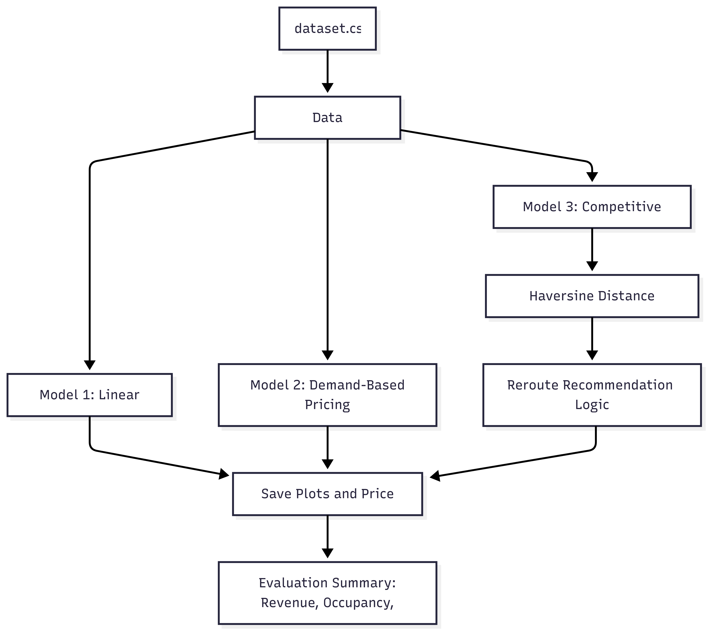
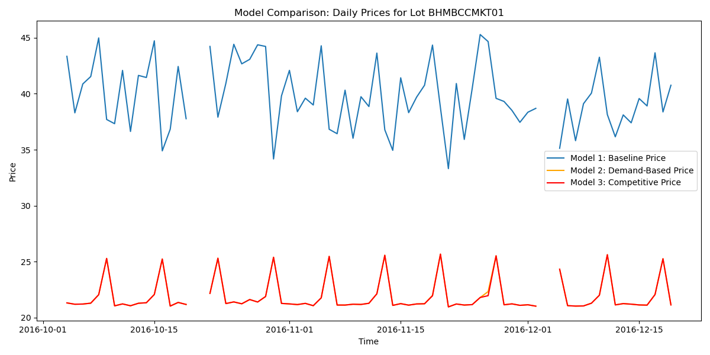

# 🚗 Dynamic Parking Pricing Capstone

> 🧪 **Note**: This is a dummy/practice project based on the Summer Analytics 2025 capstone problem. The goal was to explore feature engineering, pricing logic, and simulation workflows using real-time parking lot data — not a production deployment.

---

## 🛠️ Tech Stack
- **Language:** Python 3.8+
- **Libraries:** NumPy, Pandas
- **Visualization:** Bokeh (for real-time plotting), Matplotlib (static plots)
- **Geospatial Calculations:** Haversine formula (implemented manually)
- **Environment:** Google Colab


---

## 🔍 Project Workflow & Architecture

### 📈 Workflow Diagram
  
*End-to-end workflow: from data input and preprocessing to pricing models, evaluation, and output.*

---

### 📥 Step 1: Data Input
Loads historical parking lot data including:
- Occupancy, traffic, queue length, vehicle type, special day flag, geolocation.

---

### ⚙️ Step 2: Preprocessing
- Handles missing values, encodes features, and standardizes formats.
- Supports `test_mode` for faster debugging.

---

### 📊 Step 3: Pricing Models
- ✅ **Model 1: Linear Baseline**
  - Price = base + α × occupancy ratio
  - Simple, interpretable model with fixed coefficients.
- 📈 **Model 2: Demand-Based Pricing**
  - Computes a custom demand score using occupancy, queue length, vehicle type, traffic, time features, and special days.
  - Scores are normalized and mapped to a pricing function.
- 🤝 **Model 3: Competitive Pricing**
  - For each lot:
    - Finds nearby competitor lots using Haversine distance.
    - Compares prices and occupancy.
    - Adjusts price or recommends reroute to a cheaper nearby lot if beneficial.
    - Reroute suggestions are logged and visualized.

---

### 📉 Step 4: Evaluation
- Evaluation includes:
  - Total and average revenue
  - Occupancy
  - Number and quality of reroutes
- Plots and CSVs saved in the `/plots` directory.

---

### 📁 Project Structure
```
dynamic-parking-pricing-capstone/
├── dataset.csv
├── dynamic_pricing_notebook.ipynb
├── final_results.csv
├── README.md
└── plots/
    ├── baseline_price_BHMBCCMKT01.png
    ├── competitive_price_BHMBCCMKT01.png
    ├── demand_based_price_BHMBCCMKT01.png
    ├── model_comparison_BHMBCCMKT01.png
    ├── reroute_recommendations.csv
    └── model_workflow.png
```

---

## 🚀 Running the Project
All models are implemented in a single notebook:  
📘 `dynamic_pricing_notebook.ipynb`

To run:
1. Open the notebook in Google Colab or Jupyter.
2. Execute all cells sequentially.
3. Results and plots are saved in the `plots/` folder.

---

## 🔚 Results Summary

| Model   | Total Revenue   | Avg Revenue/Day/Lot | Avg Occupancy | Reroutes | Avg Reroute Saving |
|---------|----------------|---------------------|---------------|----------|--------------------|
| Model 1 | ₹5,637,182.93  | ₹20,878.46          | 52.14%        | N/A      | N/A                |
| Model 2 | ₹3,276,044.99  | ₹12,133.50          | 52.14%        | N/A      | N/A                |
| Model 3 | ₹3,067,680.33  | ₹11,361.78          | 52.14%        | 178      | ₹0.00              |

> 💡 **Insight**: Model 1 yields the highest revenue by ignoring fairness, while Model 3 attempts to balance user benefit and lot load distribution.

---

## 📊 Visual Outputs
- Price trend plots (baseline, demand-based, competitive)
- Reroute logs as CSV
- Model comparison charts

📁 All visuals available in the `/plots` directory.

Example:



---

## 💡 Key Learnings & Features
- Designed from scratch using just NumPy, Pandas
- Simulated real-time pricing with geospatial and queue dynamics
- Practiced feature engineering for multi-variate demand modeling
- Built competitive logic using location proximity
- Output reroute suggestions for better parking distribution

---

## 🔮 Future Scope
- Integrate real-time data streams (using Pathway or Kafka)
- Build an interactive dashboard (Streamlit or Dash)
- Add unit tests and pipeline automation
- Model user sensitivity to price and reroute behavior

---

## 👤 Author & Contact
- **Author:** Aviral Srivastava  
- 📧 **Email:** sriaviralnarain@gmail.com  
For collaboration, ideas, or questions — feel free to reach out or raise an issue!

---

## 📜 License

MIT License © 2025 Aviral Srivastava
